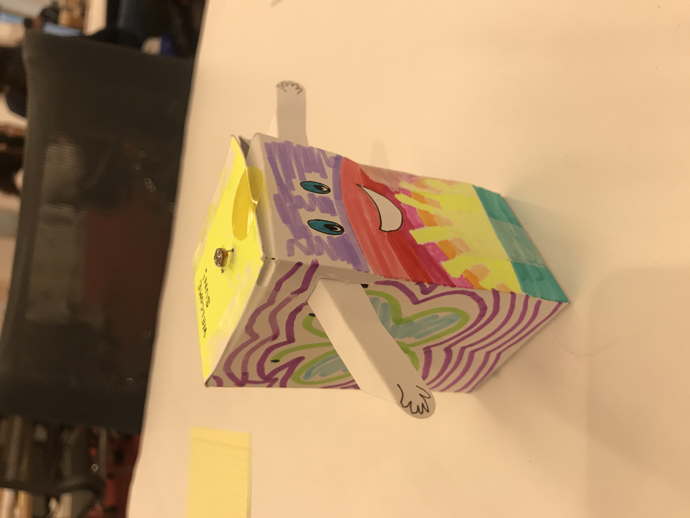
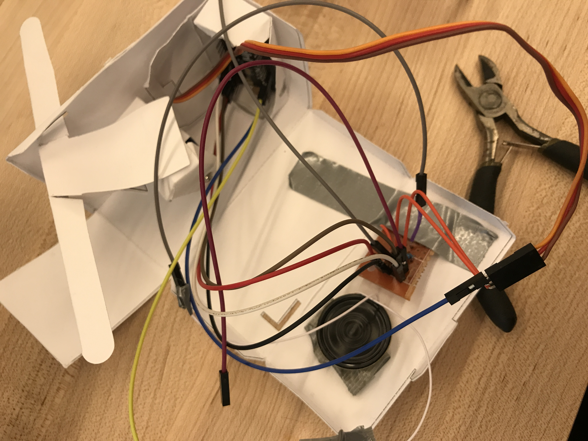
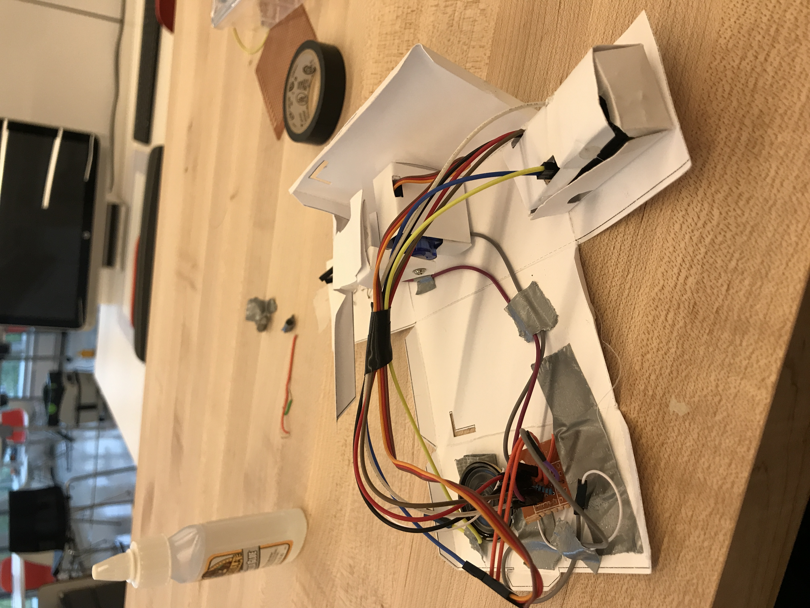

# Paper Puppets

*A lab report by Natalie B. Abrams*

## In this Report

You'll need to describe your design, include a video of your paper display in operation, and upload any code you wrote to make it move.

## Part A. Actuating DC motors

**Link to a video of your virbation motor**

[Vibrating motor!](https://youtu.be/3ppwq9WGGUE)

## Part B. Actuating Servo motors

### Part 1. Connect the Servo to your breadboard

**a. Which color wires correspond to power, ground and signal?**

Orange - Signal

Brown - Ground

Red - Power


### Part 2. Connect the Servo to your Arduino

**a. Which Arduino pin should the signal line of the servo be attached to?**

It should be attached to Pin 9.


**b. What aspects of the Servo code control angle or speed?**

If you change the Position (pos) in the For loop, it limits or extends the angle the motor will go. 

If you change the delay, the larger the number the slower it will go, and the smaller the number, 
the faster it will go. 


```
/* Sweep
 by BARRAGAN <http://barraganstudio.com>
 This example code is in the public domain.

 modified 8 Nov 2013
 by Scott Fitzgerald
 http://www.arduino.cc/en/Tutorial/Sweep
*/

#include <Servo.h>

Servo myservo;  // create servo object to control a servo
// twelve servo objects can be created on most boards

int pos = 0;    // variable to store the servo position

void setup() {
  myservo.attach(9);  // attaches the servo on pin 9 to the servo object
}

void loop() {
  for (pos = 0; pos <= 90; pos += 1) { // goes from 0 degrees to whatever you set as pos <=
    // in steps of 1 degree
    myservo.write(pos);              
    delay(45);                       // waits however many ms  you set for the servo to reach the position
  }
  for (pos = 90; pos >= 0; pos -= 1) { // goes from set number of degrees to 0 degrees
    myservo.write(pos);              
    delay(45);                       // waits however many ms  you set for the servo to reach the position
  }
}
```

## Part C. Integrating input and output

[movie of my raw circuit in action!](https://youtu.be/ckV_xu6D-Ac)

## Part D. Paper puppet

**a. Make a video of your proto puppet.**

[My Proto Puppet!](https://youtu.be/ZPeaWrhV6HY)

## Part E. Make it your own

**a. Make a video of your final design.**

[Robot in action!](https://youtu.be/D9TBtqR4vrU)
 
 [Code!](./mySweep2.ino)
 
 [Pitches File](./pitches.h)
 
 ### Images of my robot!
 
 
 
 
